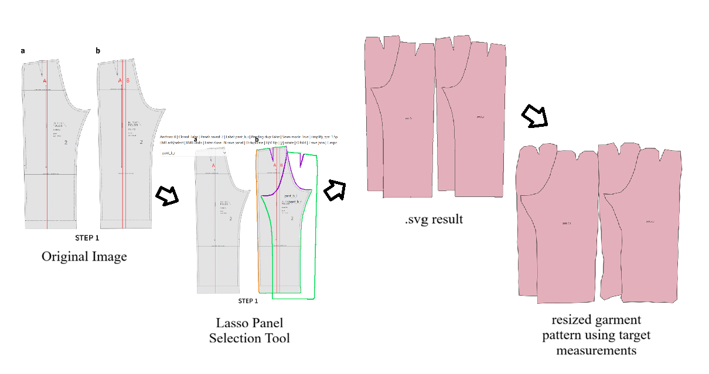
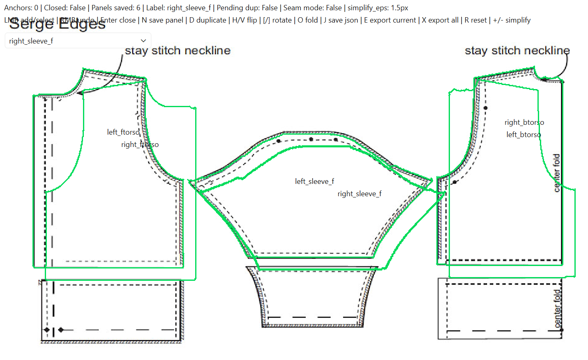

# Sewing Pattern Retargeting & Pattern Extraction

Prototype pipeline for extracting sewing pattern panels from images and retargeting them to new body measurements using machine learning.

<p align="center">
  
</p>

<p align="center">
  <em>1: Original garment pattern image. 2: Lasso tool pattern selection. 3: Extracted .svg filetype. 4: Retargeted pattern with updated size.</em>
</p>

---

## Project Overview

This project explores how machine learning can assist with sewing pattern resizing and adaptation.

The pipeline combines:

- interactive sewing pattern extraction from images
- panel labeling and edge matching
- geometric pattern processing
- neural pattern retargeting conditioned on body measurements

The goal is to support workflows such as:

```text
sewing pattern image
        ↓
interactive panel extraction
        ↓
structured sewing pattern representation
        ↓
body-conditioned pattern retargeting
        ↓
resized/exportable sewing pattern
```

---

# Repository Structure

```text
src/
    pattern_lasso_v2.py        Interactive extraction tool
    pattern_core_*             Internal pattern data structures

    panel_mapping/
        lasso_to_model_input.py
        run_lasso_to_model.sh
        size_charts/

models/
    pattern_retarget_shirt_v2.pt
    pattern_retarget_pants_only_v1.pt

docs/
    images/
```

---

# Features

## Interactive Pattern Extraction

The lasso tool supports:

- edge-snapping pattern tracing
- semantic garment panel labeling
- seam pairing annotation
- panel duplication / mirroring
- structured JSON export

<p align="center">
  
</p>

Additional examples and controls are documented in:

```text
src/project/README.md
src/project/panel_mapping/README.md
models/README.md
```

---

## ML-Based Pattern Retargeting

The retargeting model:

- consumes structured garment panel geometry
- conditions on body measurements
- predicts resized panel geometry
- preserves garment structure through conservative blending, maintaining aesthetic choices 

Currently supported garment categories:

- shirts
- pants

---

# Current Status

This repository is an active research prototype.

Current strengths:

- successful panel extraction from real sewing patterns
- semantic panel labeling workflow
- end-to-end lasso → model → SVG pipeline
- pretrained shirt and pants retargeting checkpoints

Current limitations:

- limited training distribution
- training data limited in structure -- only allows 4 torso panels for a shirt, for example
- partial support for complex garment details
- no final sewing instruction generation yet

Patterns currently work best when they:

- use non-stretch woven fabrics
- contain relatively simple panel structures
- avoid highly decorative construction details such as pockets

---

# Example Pipeline

## 1. Extract Pattern Panels

```bash
python src/pattern_lasso_v2.py
```

## 2. Label Panels + Match Seams

Export structured garment JSON.

## 3. Run Retargeting

```bash
./run_lasso_to_model.sh \
  pattern_project.json \
  source_measurements_gc.yaml \
  target_measurements_gc.yaml \
  checkpoint.pt \
  output_dir
```

## 4. Export SVG Output

Predicted garment panels are exported as SVG for visualization.

---
## Dataset / External Resources

This project uses garment geometry and body measurement data derived from the GarmentCode dataset and framework.

GarmentCode:
- https://github.com/maria-korosteleva/GarmentCode

If you use this repository for research purposes, please also cite the original GarmentCode work.

The machine learning models in this repository were trained on processed garment/body data generated from GarmentCode assets.

# Research Direction

This project investigates where learned geometric priors may be useful in sewing pattern adaptation.

Traditional grading methods work well for many standardized garments, but learned models may help preserve higher-level design characteristics in garments with:

- complex silhouettes
- stylistic ease variations
- unconventional proportions
- non-standardized construction logic

The project focuses on combining human-guided extraction with learned geometric retargeting.

---

# Requirements

Core dependencies:

```bash
pip install \
    numpy \
    torch \
    PyQt6 \
    opencv-python \
    mapbox-earcut \
    matplotlib \
    pyyaml
```

---

# Author

Senior thesis / research prototype exploring machine learning approaches for sewing pattern retargeting and garment geometry processing.
