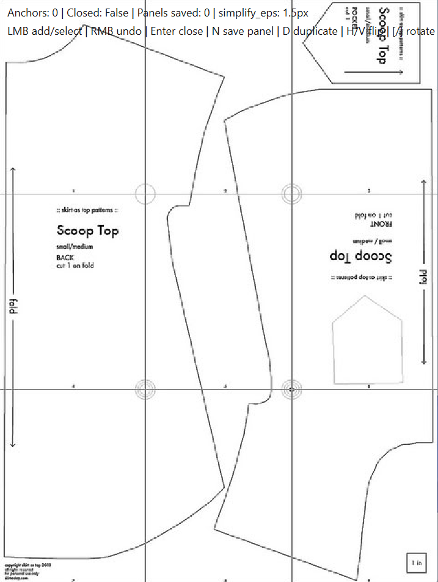

# Learning-Based Garment Pattern Retargeting (temporary chatgpt readme)

Research project exploring machine learning approaches for resizing and retargeting sewing patterns while preserving garment structure and stylistic features.

This repository contains:

- an interactive pattern extraction / lasso annotation tool
- geometry conversion utilities
- dataset processing pipelines
- ML models for garment retargeting
- evaluation and visualization scripts

The project is built around the idea of converting arbitrary sewing patterns into structured geometric representations that can later be resized or adapted to new body measurements.

---

# Project Goal

Traditional garment drafting systems rely on explicit drafting rules and handcrafted sizing formulas.

This project instead explores a **data-driven approach**:

```text
Pattern Image / PDF
        ↓
Structured Pattern Extraction
        ↓
Geometric Representation
        ↓
ML-Based Retargeting
        ↓
Resized Garment Pattern
```

The long-term goal is to support:

- historical sewing patterns
- scanned PDF patterns
- arbitrary drafting systems
- style-preserving resizing
- downstream garment simulation pipelines

---

# Repository Structure

```text
.
├── docs/
│   └── images/
│
├── models/
│   └── trained checkpoints (.pt)
│
├── project/
│   └── interactive lasso / annotation tool
│
├── src/
│   ├── evaluation/
│   ├── export/
│   ├── geometry/
│   └── training/
│
└── README.md
```

---

# Main Components

## 1. Pattern Lasso Tool

Interactive annotation tool for extracting garment panels from sewing pattern images.

Features include:

- magnetic lasso edge snapping
- panel extraction
- duplication / mirroring tools
- seam pairing
- export to structured pattern format

<p align="center">
  
</p>

See:

```text
project/README.md
```

for the full workflow guide.

---

## 2. Garment Retargeting Models

PyTorch-based models trained on the GarmentCode dataset to learn:

```text
(pattern geometry + body measurements)
            ↓
retargeted garment pattern
```

Current experiments include:

- shirts
- pants
- multi-panel garments

The models aim to preserve:

- garment topology
- panel structure
- stylistic proportions
- seam relationships

while adapting to new body measurements.

---

## 3. Geometry / Export Utilities

Utilities for:

- SVG conversion
- mesh generation
- panel export
- structured pattern serialization

These tools connect the annotation pipeline to downstream ML workflows.

---

# Dataset

This project uses the:

## GarmentCode Dataset

GitHub:
https://github.com/maria-korosteleva/GarmentCode

The dataset provides:

- sewing pattern specifications
- body measurements
- panel geometry
- seam topology
- SVG exports
- mesh-compatible garment representations

The current pipeline focuses on:

- shirt retargeting
- pants retargeting
- style-preserving geometric adaptation

---

# Current Pipeline

## Annotation

```text
Pattern image
    ↓
Interactive lasso extraction
    ↓
Structured garment representation
```

## Retargeting

```text
Source garment + target body
            ↓
Neural network prediction
            ↓
Updated panel geometry
```

## Export

```text
Predicted geometry
        ↓
SVG / mesh export
```

---

# Current Limitations

This repository is an active research prototype.

Known limitations include:

- limited support for highly detailed garments
- limited support for pockets / cuffs / lining panels
- limited support for stretch garments
- no cloth simulation
- no automatic pattern parsing from PDFs
- limited dataset diversity for complex garments

The current system works best on:

- simpler woven garments
- lower-panel-count patterns
- non-stretch garments

---

# Requirements

Main dependencies:

- Python 3.9+
- PyTorch
- PyQt6
- numpy
- opencv-python
- matplotlib
- mapbox_earcut

---

# Installation

```bash
git clone https://github.com/jamduf/senior-thesis.git
cd senior-thesis

pip install -r requirements.txt
```

---

# Example Workflow

## Train a model

```bash
python src/training/model_test.py \
  --batch_dir path/to/garments_5000_0 \
  --epochs 10 \
  --filter_mode shirt
```

---

## Evaluate a checkpoint

```bash
python src/evaluation/evaluate_checkpoint.py \
  --checkpoint models/pattern_retarget_shirt_v2.pt
```

---

## Launch the lasso tool

```bash
python project/pattern_lasso_v2.py
```

---

# Research Direction

This project explores:

- learned garment retargeting
- geometric style preservation
- sewing pattern extraction
- shape correspondence
- ML-assisted apparel design pipelines

The broader objective is to build systems capable of adapting arbitrary sewing patterns to new body measurements without requiring explicit drafting rules.

---

# Status

Current functionality:

- shirt retargeting
- pants retargeting
- panel extraction tooling
- seam pairing
- SVG export
- evaluation pipelines

In progress:

- jacket support
- improved topology handling
- historical pattern support
- automated pattern parsing
- improved style preservation
